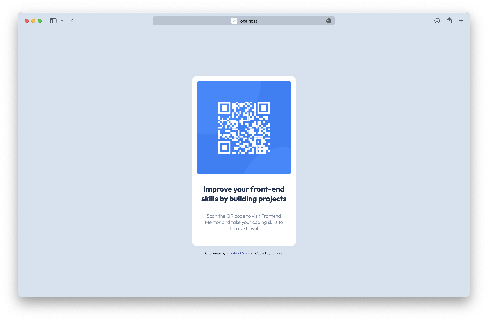

# Frontend Mentor - QR code component solution

This is a solution to the [QR code component challenge on Frontend Mentor](https://www.frontendmentor.io/challenges/qr-code-component-iux_sIO_H). Frontend Mentor challenges help you improve your coding skills by building realistic projects. 

## Table of contents

- [Overview](#overview)
  - [Screenshot](#screenshot)
  - [Links](#links)
- [My process](#my-process)
  - [Built with](#built-with)
  - [What I learned](#what-i-learned)
- [Author](#author)

## Overview

### Screenshot



### Links

- Solution URL: [github.com/thinhlevn/qr-code-component-main](https://github.com/thinhlevn/qr-code-component-main)
- Live Site URL: [thinhlevn.github.io/qr-code-component-main/](https://thinhlevn.github.io/qr-code-component-main/)

## My process

### Built with
- Semantic HTML5 markup
- CSS custom properties
- Flexbox

### What I learned

[`theme-color` meta tags](https://css-tricks.com/safari-15-new-ui-theme-colors-and-a-css-tricks-cameo/)

```html
<meta name="theme-color" 
      content="#ecd96f" 
      media="(prefers-color-scheme: light)">
<meta name="theme-color" 
      content="#0b3e05" 
      media="(prefers-color-scheme: dark)">
```

## Author

- Website - [thinh.xyz](https://thinh.xyz)
- Frontend Mentor - [@thinhlevn](https://www.frontendmentor.io/profile/thinhlevn)
- Twitter - [@fatbug97](https://www.twitter.com/fatbug97)
